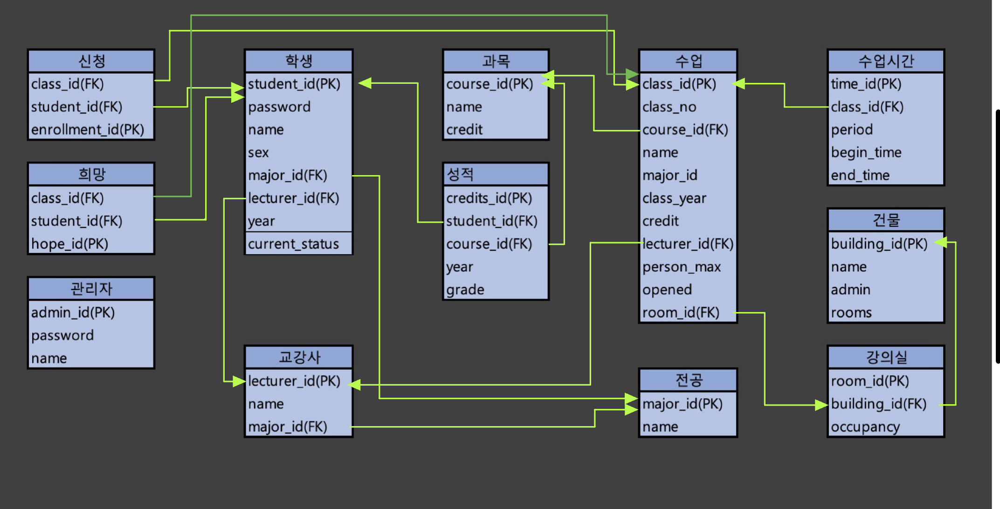
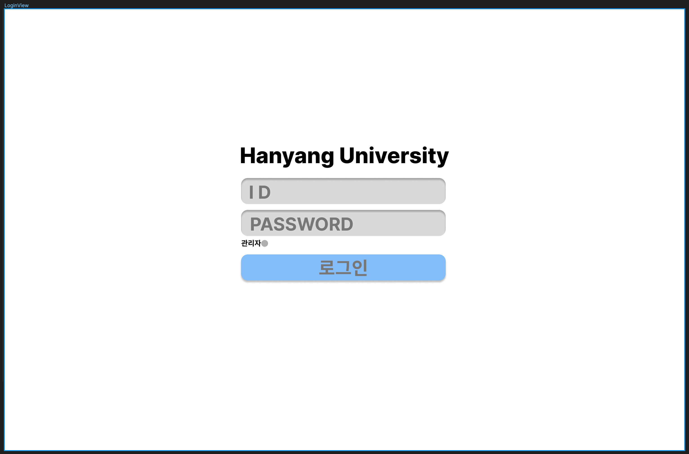

# 데이터베이스시스템 #Project1

- Database Schema
    
    
    
- Application Design



로그인 화면

아이디와 패드워드를 입력한 뒤 로그인 버튼을 누르면 아이디의 종류에 따라 관리자/사용자 화면으로 진입한다. 관리자일 경우에는 관리자 란에 체크를 하고 로그인 시도한다. 정보가 없는 경우 - 잘못된 아이디, 비밀번호 입니다 라는 팝업을 띄운다. / 같은 정보가 있는 경우 - 유형에 따라 관리자 혹은 유저 화면으로 전환


유저가 보는 메인 화면

로그아웃 버튼 - 로그아웃후 로그인뷰로 전환

검색 테이블 - 수업번호/학수번호/교과목 중에 원하는 정보를 선택해서 그 정보를 통해 수업을 검색한다. 수업에 대한 정보들을 얻을수 있으며, 해당 테이블에서 수강신청/희망신청 이 가능하다.

신청된 과목 테이블 - 내가 이미 수강 신청한 수업들에 대한 테이블을 보여준다. 시간표만들기 버튼을 누를 시 현재 신청한 과목을 기준으로 시간표를 만들어준다. 수강취소 버튼을 통해 신청한 과목을 취소할 수 있다. 

+) 희망과목 테이블 -  희망한 과목의 리스트를 보여주며 이 테이블에서도 수강신청을 할 수 있다.

+) 정보 변경 → 로그아웃 버튼 옆에 휴학/재학/퇴학 상태 변경


관리자가 보는 메인화면

로그아웃 버튼 - 로그아웃 후 로그인 뷰로 전환

검색 테이블 - 수업번호/학수번호/교과목 중에 원하는 정보를 선택해서 그 정보를 통해 수업을 검색한다. 수업에 대한 정보들을 얻을수 있으며, 해당 테이블에서 수강개설 및 삭제가 가능하다. (과목증원, 수강허용) (수정가능한 부분은 text입력칸을 두어 수정가능하게 하고 수정버튼을 누르면 수정한 부분을 저장한다)

학생 조회 테이블 - 학생을 검색하고 학생에 대한 정보들을 조회할 수 있으며 학생의 상태를 변경할 수 있다. (시간표는 버튼을 두어 누르면 시간표가 뜨게, 상태변경도 마찬가지로)

수업 추가 테이블 - 수업에 대한 정보를 입력하고 추가버튼을 누르면 수업이 추가된다.

통계 테이블 - 평점평균-과목학점 이 가장 큰 과목 TOP10 을 게시한다.

- SQL

(User)로그인 

```sql
--주어진 값 : id_from_web, password_from_web
select student_id
from student
where id_from_web=student_id and password_from_web=password
```

(Admin)로그인

```sql
--주어진 값 : id_from_web, password_from_web
select admin_id
from admin
where id_from_web=admin_id and password_from_web=password
```

수업 검색 - 수업 번호 (수업번호, 학수번호, 교과목명, 교강사이름, 수업시간, 신청인원, 수강정원, 강의실 건물, 강의실 호수, 유저면 신청버튼)

```sql
--주어진 값 : class_no_from_web
**SELECT** class_no, coure_id, name, major_id, lecturer.name, time.begin, tme.end, enrollment_table.enrollment_count, person_max, building.name, building.rooms
**FROM** class join lecturer using (lecturer_id) join time using (class_id) join room using (room_id) join building using (building_id) join (select count(*) as enrollment_count, class_id from enrollment group by class_id) as enrollment_table using (class_id)
where class_no_from_web = class_no
```

수업 검색 - 학수 번호

```sql
--주어진 값 : course_no_from_web
**SELECT** class_no, coure_id, name, major_id, lecturer.name, class_time.begin_time, tme.end_time, enrollment_table.enrollment_count, person_max, building.name, building.rooms
**FROM** class join lecturer using (lecturer_id) join class_time using (class_id) join room using (room_id) join building using (building_id) join (select count(*) as enrollment_count, class_id from enrollment group by class_id) as enrollment_table using (class_id)
where course_no_from_web = course_no
```

수업 검색 - 교과목

```sql
--주어진 값 : name_from_web
**SELECT** class_no, coure_id, name, major_id, lecturer.name, class_time.begin_time, tme.end_time, enrollment_table.enrollment_count, person_max, building.name, building.rooms
**FROM** class join lecturer using (lecturer_id) join class_time using (class_id) join room using (room_id) join building using (building_id) join (select count(*) as enrollment_count, class_id from enrollment group by class_id) as enrollment_table using (class_id)
where name like "%name_from_web%"
```

수업 시간표 생성

```sql
-- 주어진 값 : current_student_id
select begin_time, end_time
from enrollment join class_time using (class_id)
where current_student_id = student_id and begin_time not like "1900-01-06%"
```

(User) 수강 신청 - 이전 성적이 B0 이상인지? / 정원은 다 찼는지 / 시간이 겹치는지 / 최대학점에 안넘는지

```sql
-- 주어진 값 : current_student_id, class_id_to_enroll
insert into enrollment
select current_student_id, class_id, (select enrollment_id from enrollment order by enrollment_id desc limit 1) + 1 
from class join class_time
where class_id = class_id_to_enroll 
and ("B0","B+","A0","A+") not in ( select grade from credit where student_id = current_student_id and course_id = ( select course_id from class where class_id = class_id_to_enroll)) 
and person_max > ( select count(*) from enrollment where class_id = class_id_to_enroll group by class_id )
and not exist (select * from (select * from enrollment join class_time where student_id = current_student_id) as T where (begin_time between T.begin_time and T.end_time) or (end_time between T.begin_time and T.end_time))
and (select sum(credit) from enrollment join class on (student_id = current_student_id)) + credit < 19 
```

(User) 희망 강의 신청

```sql
-- 주어진 값 : current_student_id, class_id_to_enroll
insert into hope
select class_id, current_student_id, (select hope_id from hope order by hope_id desc limit 1) + 1 
from class
where class_id not in (select class_id from hope where student_id = current_student_id)
```

(Admin) 수업 설강

```sql
-- 주어진 값 : class 의 모든 attribute + class_time 의 모든 attribute
insert into class
select class_id_insert, class_no_insert, course_id_insert, name_insert, major_id_insert, class_year_insert, credit_insert, lecturer_id_insert, person_max_insert, opened_insert, room_id_insert
from DUAL
where person_max_insert > (select occupancy from room where room_id = room_id_insert) and begin_time_inset not like "1900-01-07%"

insert into class_time
select (time_id_insert, class_id_insert, period_insert, begin_time_insert, end_time_insert
from DUAL
where exist (select class_id from class where class_id = class_id_insert)
```

(Admin) 수업 폐강 → 희망, 신청 에서도 삭제

```sql
--주어진 값 : class_id_to_delete
delete class, enrollment, hope, class_time
where class_id_to_delete = class_id
```

(Admin) 수업 수정 - 과목증원, 수강허용변경

```sql
-- 주어진 값 : person_num_update, class_id_to_update
update class
set person_max = person_num_update
where class_id = class_id_to_update

-- 주어진 값 : opened_update, class_id_to_update
update class
set opened = opened_update
where class_id = class_id_to_update
```

(Admin) 학생 정보 조회 - 금학기 시간표 / 성적 / 지도교수 / 재학,휴학,자퇴

```sql
-- 금학기 시간표
-- 주어진 값 : student_id_to_search
select name, begin_time, end_time
from enrollment join class on (student_id = student_id_to_search) join class_time

-- 성적
-- 주어진 값 : student_id_to_search
select name, grade
from credit join course
where student_id = student_id_to_search

-- 지도교수
-- 주어진 값 : student_id_to_search
select lecturer.name
from student join using (lecturer_id)
where student_id = student_id_to_search

-- 재학/휴학/자퇴
-- 주어진 값 : student_id_to_search
select current_status
from student
where student_id = student_id_to_search
```

(Admin) OLAP

```sql
-- 평점 평균과 특정 과목의 학점 간 차이 ( 평점 평균 - 과목 학점 ) 이 가장 큰 탑10 뽑기
-- 전체 평균 구하고 과목평균 구하고 빼서 정렬 
with score_table as (
select course_id, case when grade = "A+" then 4.5
														 when grade = "A" then 4
														 when grade = "B+" then 3.5
														 when grade = "B" then 3
														 when grade = "C+" then 2.5
														 when grade = "C" then 2
														 else 0
														 end as [grade_to_score]
from credit)
),
avg_score_table as (
select course_id, avg(grade_to_score), (select avg(grade_to_score) from score_table) as all_avg 
from score_table
group by course_id
)

select name, abs(grade_to_score - all_avg) as diff_avg
from avg_score_table
order by diss_avg
limit 10
```